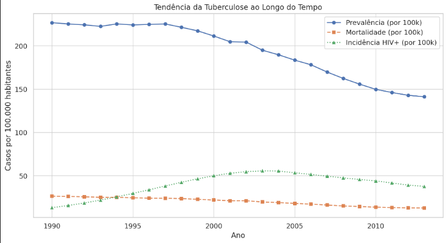
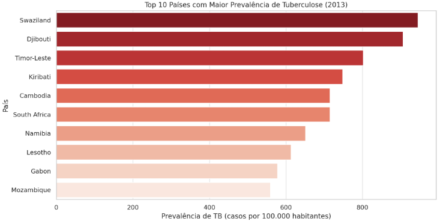

#### Visão Geral dos Dados
O conjunto de dados contém informações sobre a carga de tuberculose em vários países, incluindo estimativas de prevalência, incidência, mortalidade e taxas de detecção de casos. Os dados são fornecidos anualmente de 1990 a 2013. 

As colunas de dados incluem:

- Informações geográficas (país, códigos ISO, região)
Ano
- Estimativas populacionais
- Estimativas de prevalência de TB (todas as formas) por 100.000 habitantes
- Estimativas de mortalidade por TB (excluindo HIV) por 100.000 habitantes
- Estimativas de incidência de TB (todas as formas) por 100.000 habitantes
- Estimativas de HIV em TB incidente (percentual)
- Taxa de detecção de casos (todas as formas), porcentagem

---
### Informações Gerais e Observações Iniciais:

1. **População Total**

   - Média: cerva de 29 milhões de habitantes por país-ano
   - Mínimo: 1.129 habitantes
   - Máximo: 1,38 bilhão de habitantes

2. **Prevalência de Tuberculose (casos por 100.000 habitantes)**

   - Média: 194 casos
   - Mediana: 85 casos
   - Máximo: 1.762 casos

3. **Mortalidade de TB (excluindo HIV, por 100.000 habitantes)**

   - Média: 20 óbitos
   - Mediana: 5,4 óbitos
   - Máximo: 278 óbitos

4. **Incidência de TB associada ao HIV (por 100.000 habitantes)**
   - Média: 40 casos
   - Mediana: 2,1 casos
   - Máximo: 1.063 casos

### Tendências ao longo do tempo:

1. **Prevalência da Tuberculose** – Houve uma tendência de queda, indicando que a incidência geral da doença tem diminuído.
2. **Mortalidade por Tuberculose (excluindo HIV)** – Também apresenta uma redução, sugerindo que os tratamentos e políticas de saúde pública estão sendo eficazes.
3. **Incidência de Tuberculose associada ao HIV** – Essa métrica variou ao longo dos anos, mas há uma tendência de redução, refletindo avanços no tratamento da coinfecção TB-HIV.

---

### Grafico dos 10 países com maior prevalência de TB

- O gráfico  destaca os 10 países com a maior prevalência de tuberculose no ano mais recente disponível. Observamos que esses países apresentam taxas significativamente elevadas de casos por 100.000 habitantes, indicando desafios persistentes no controle da doença. 

- A alta incidência pode estar associada a fatores como condições socioeconômicas, acesso limitado a serviços de saúde e a presença de outras comorbidades, como HIV. Essa análise reforça a necessidade de políticas públicas eficazes, campanhas de conscientização e investimentos em infraestrutura de saúde para reduzir o impacto da tuberculose nessas regiões.

## Análise de alguns países:

**Afeganistão**

- **População**: A população do Afeganistão mostra um aumento constante de 1990 (11.731.193) para 2013 (30.551.674).
- **Prevalência de TB**: A prevalência estimada de TB aumentou de 306 por 100.000 em 1990 para aproximadamente 450 por 100.000 em 2000, depois diminuiu gradualmente para 340 por 100.000 em 2013.
- **Incidência de TB**: A incidência estimada de TB aumentou de 189 por 100.000 em 1990 para aproximadamente 190 por 100.000 em 2013.
- **Mortalidade por TB**: A mortalidade estimada por TB aumentou de 37 por 100.000 em 1990 para aproximadamente 70 por 100.000 em 2000, depois diminuiu gradualmente para 42 por 100.000 em 2013.
- **HIV em TB incidente**: A porcentagem estimada de HIV em TB incidente aumentou de 0,06% em 1990 para 0,34% em 2013.
- **Taxa de detecção de casos**: A taxa de detecção de casos melhorou significativamente de 20% em 1990 para 53% em 2013.

**Albânia**

- **População**: A população da Albânia mostra um ligeiro decréscimo de 1990 (3.446.882) para 2013 (3.173.271).
- **Prevalência de TB**: A prevalência estimada de TB diminuiu de 36 por 100.000 em 1990 para 27 por 100.000 em 2013.
- **Incidência de TB**: A incidência estimada de TB permaneceu relativamente estável em 24 por 100.000 de 1990 a 1997, depois diminuiu para 18 por 100.000 em 2013.
- **Mortalidade por TB**: A mortalidade estimada por TB diminuiu de 1,8 por 100.000 em 1990 para 0,64 por 100.000 em 2013.
- **Taxa de detecção de casos**: A taxa de detecção de casos melhorou ligeiramente de 78% em 1990 para 81% em 2013.

**Argélia**

- **População**: A população da Argélia mostra um aumento constante de 1990 (26.239.708) para 2013 (38.760.277).
- **Prevalência de TB**: A prevalência estimada de TB aumentou de 100 por 100.000 em 1990 para 140 por 100.000 em 2007, depois diminuiu ligeiramente para 134 por 100.000 em 2013.
- **Incidência de TB**: A incidência estimada de TB aumentou de 64 por 100.000 em 1990 para 90 por 100.000 em 2007, depois diminuiu ligeiramente para 85 por 100.000 em 2013.
- **Mortalidade por TB**: A mortalidade estimada por TB permaneceu relativamente estável em 11-14 por 100.000 de 1990 a 2013.
- **HIV em TB incidente**: A porcentagem estimada de HIV em TB incidente aumentou de 0,06% em 1990 para 0,36% em 2013.
- **Taxa de detecção de casos**: A taxa de detecção de casos diminuiu de 69% em 1990 para 66% em 2013.

**Insights Gerais**

- **Tendências Populacionais**: Todos os três países apresentaram crescimento populacional ao longo do período.
- **Prevalência e Incidência**: O Afeganistão apresentou um padrão de aumento e diminuição na prevalência e incidência de TB, enquanto a Albânia mostrou um declínio geral. A Argélia apresentou um ligeiro aumento na prevalência e incidência de TB.
- **Taxa de Detecção de Casos**: O Afeganistão e a Albânia mostraram melhorias nas taxas de detecção de casos, indicando melhores esforços de diagnóstico. A Argélia apresentou um ligeiro decréscimo na taxa de detecção de casos.
- **HIV em TB incidente**: A porcentagem estimada de HIV em TB incidente aumentou em todos os três países.

